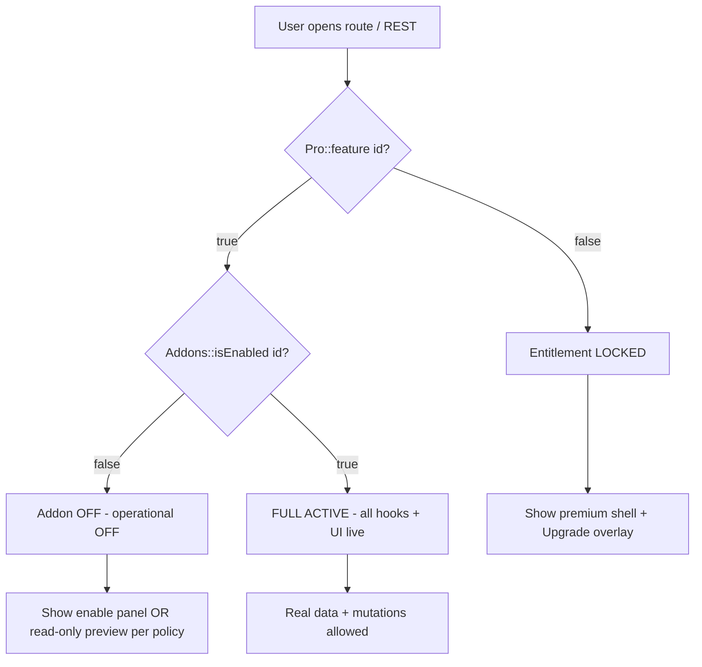

# Sikshya LMS — AI & Engineering Blueprint: Addons, Premium Features, and Doc Parity

**Audience:** Autonomous coding agents, staff engineers, and product QA.  
**Goal:** Implement and verify a **single, consistent model** so that every addon/feature from `FeatureRegistry` and from product docs behaves predictably: **correct backend when enabled**, **complete UI when enabled**, **no leakage when disabled**, **visible premium surfaces with plan-aware upgrade overlays** when the customer’s license tier is insufficient.

This document is **normative**: treat unchecked items as **work to do**, not as optional polish.

---

## Part A — Mental model (read this first)

### A.1 Three independent axes (do not conflate them)

| Axis | What it means | Primary code / data |
|------|----------------|---------------------|
| **1. Catalog membership** | The feature **exists** in the product definition (`FeatureRegistry::definitions()`). Every row is a **stable string ID** (example: `content_drip`, `gradebook`). | `src/Licensing/FeatureRegistry.php` |
| **2. Addon enablement (site toggle)** | The site owner **turned the module on** in Addons. Persisted list of enabled IDs. | `Sikshya\Addons\Addons::isEnabled( $id )`, option `addons_enabled` |
| **3. Plan / license entitlement** | The **commercial contract** allows that tier’s features. Starter → Growth → Scale. | `Sikshya\Licensing\Pro::isActive()`, `Pro::siteTier()`, `Pro::feature( $id )` |

**Hard rule for implementers:** A feature must be treated as **fully active** only if:

```text
Pro::feature( $featureId ) === true
AND (for paid-only surfaces) Addons::isEnabled( $featureId ) === true
AND (if Pro plugin provides REST) routes register only when both are true
```

Free-tier features (`tier === 'free'` in registry) must satisfy **`Pro::feature()`** (always true for free tier) and **`Addons::isEnabled()`** if you still use the addon toggle for free modules.

### A.2 Why `FeatureAddon::boot()` is often empty

Generic addons use `Sikshya\Addons\FeatureAddon`, whose **`boot()` is intentionally empty**. Real hooks live in:

- **Sikshya (free)** services, REST, admin UI, and
- **Sikshya Pro** (`sikshya-pro` plugin): `Bootstrap`, `*Service`, `*Routes`, `ProAccessHooks`, cron, etc.

**Implication for AI:** “Implement addon X” means **(1)** wire **PHP hooks + REST + schema** when enabled and licensed, **(2)** wire **React route + page + learner/admin UI**, **(3)** add **acceptance tests** — not merely add a row to `FeatureRegistry`.

### A.3 Product documentation that is source-of-truth for *scope*

These files define **what humans expect to buy**. Implementation must either **match** them or the docs must be revised — there is no third state for production.

| Document | Role |
|----------|------|
| `docs/product/sikshya-free.md` | Free tier functional and UX scope |
| `docs/product/sikshya-pro.md` | Pro / Growth tier depth |
| `docs/product/sikshya-elite.md` | Elite / Agency marketplace, API, enterprise |
| `docs/SIKSHYA_FREE_VS_PRO.md` | Technical split: free plugin vs Pro plugin responsibilities |
| `docs/SIKSHYA_REST_ROUTE_MAP.md` | REST surface inventory (must stay aligned with routes) |
| `docs/product/roadmap-and-upgrade-funnel.md` | Conversion moments and sequencing |

**AI task:** For every **bullet** in those docs, create or update a row in an internal matrix: **Doc bullet → `featureId` → Owner (free|pro) → Status (Shipped|Partial|Missing)**. This blueprint’s **Part F** seeds that matrix.

---

## Part B — Canonical list of `featureId` values (copy-paste safe)

Below is the **complete** set of IDs from `FeatureRegistry::definitions()` as of this blueprint. **Do not invent new IDs** without updating the registry, REST serialization, React `featureStates`, and docs.

### B.1 Free tier (`tier = free`)

`core_course_builder`, `lesson_video_text`, `lesson_attachments`, `course_preview_faq`, `announcements`, `student_dashboard`, `wishlist`, `quiz_basic`, `certificates_basic`, `assignments_basic`, `checkout_native`, `manual_enrollment`, `coupons_basic`, `free_courses`, `basic_reports`, `single_instructor`, `email_notifications_basic`, `page_builder_widgets_basic`

### B.2 Starter tier (`tier = starter`)

`content_drip`, `prerequisites`, `instructor_dashboard`, `drip_notifications`, `calendar`

### B.3 Growth / “Pro” band (`tier = pro`)

`multi_instructor`, `reports_advanced`, `gradebook`, `activity_log`, `certificates_advanced`, `subscriptions`, `course_bundles`, `coupons_advanced`, `assignments_advanced`, `quiz_advanced`, `live_classes`, `social_login`, `crm_email_automation`, `scorm_h5p_pro`

### B.4 Scale band (`tier = scale` — top commercial plan)

`marketplace_multivendor`, `white_label`, `automation_zapier_webhooks`, `public_api_keys`, `multisite_scale`, `enterprise_reports`, `multilingual_enterprise`

---

## Part C — Runtime state machine (for UI and backend)

Use this exact vocabulary in code comments and QA tickets.



**Locked (`Pro::feature` false):** Customer does not pay for that tier. **Backend must reject** mutating operations (REST 403, `WP_Error`, or no-op). **Frontend must still show** the screen layout (see Part D) with **upgrade overlay**, not a blank route or 404.

**Addon off (`Addons::isEnabled` false):** Owner chose not to load module. **Backend must not register** expensive hooks for that module. **Frontend** should show **Enable addon** CTA (existing `AddonEnablePanel` pattern) **or** read-only marketing preview — pick one policy globally; current codebase mixes patterns.

**Full active:** All documented behaviors for that module must work end-to-end.

---

## Part D — UI/UX specification (premium surfaces & overlays)

### D.1 Non-negotiable UX principles

1. **Discoverability:** Every paid capability that has a **dedicated admin route** or **learner-facing entry** must remain **reachable in navigation** (sidebar, settings tabs, or course builder panels). **Do not remove nav nodes** solely because `Addons::isEnabled` is false or license is missing — use **badges** (`Off`, `Locked`, `Upgrade`) instead.
2. **Truthful preview:** When locked, the user still sees **what the product would look like** (wireframe or read-only sample list) under a **semi-transparent overlay** — not only a centered empty card (avoid replacing the whole route with a single upsell card).
3. **Plan clarity:** Overlay must show:
   - **Feature name** (from `FeatureRegistry` label),
   - **One-line benefit** (from description or doc),
   - **Minimum plan** (map `tier` → human label: starter → Starter, pro → Growth, scale → Scale),
   - **Primary CTA:** “Upgrade plan” (link to store / pricing with UTM),
   - **Secondary:** “Manage addons” → `view=addons`.
4. **Accessibility:** Overlay is a **dialog pattern**: focus trap, `role="dialog"`, `aria-modal="true"`, Esc closes only if you provide an alternative path to upgrade, labelled buttons, visible focus ring.
5. **No false affordances:** Inputs under overlay are **`disabled`** or **`pointer-events-none`**; no silent failed saves.

### D.2 Component contract (recommended React implementation)

Define a single wrapper used by all gated admin pages:

```text
<GatedFeatureWorkspace
  featureId="gradebook"           // must match FeatureRegistry + Addons id
  title="…"
  subtitle="…"
  shellProps={…}                  // AppShell
  planOverlayVariant="upgrade"    // upgrade | enable-addon
>
  {({ mode }) => (
    mode === 'full' ? <RealGradebookUI /> : <PreviewGradebookSkeleton />
  )}
</GatedFeatureWorkspace>
```

**Modes:**

| `mode` | Condition | Child render |
|--------|-----------|--------------|
| `full` | `Pro::feature(id) && Addons::isEnabled(id)` | Full interactive UI |
| `locked-plan` | `!Pro::feature(id)` | Skeleton + **UpgradeOverlay** |
| `addon-off` | `Pro::feature(id) && !Addons::isEnabled(id)` | Skeleton + **AddonEnablePanel** |

**Data source:** Prefer `config.licensing.featureStates[id]` from `getConfig()` / `ShellStateContext` after refresh — must match server `Pro::featureStates()`.

### D.3 Mapping `tier` → overlay “Required plan” copy

| Registry `tier` | Overlay label |
|-----------------|---------------|
| `starter` | Starter |
| `pro` | Growth |
| `scale` | Scale |

**Do not use deprecated slug `business`** in new UI; `Pro::siteTier()` uses `growth`.

---

## Part E — Backend implementation contract

### E.1 For every `featureId` that mutates data

Minimum checklist:

- [ ] REST: `permission_callback` + early `if ( ! Pro::feature( 'id' ) ) { return 403; }` for write routes.
- [ ] REST: `if ( ! Addons::isEnabled( 'id' ) )` for routes that belong to optional modules.
- [ ] Hooks: expensive work registered only inside `Addons::isEnabled` && `Pro::feature` checks (or dedicated bootstrap called from Pro `Bootstrap` that internally checks).
- [ ] Cron: scheduled events **unschedule** when addon disabled.
- [ ] DB migrations: `ProSchema` (or free equivalent) versioned; no fatal if table missing — graceful `WP_Error`.

### E.2 For every `featureId` with learner impact

- [ ] Access pipeline: `sikshya_access_check` (or successor) respects drip / prerequisites / subscriptions when enabled + licensed.
- [ ] Outline / curriculum UI receives `locked` + `lock_reason` for learner messaging (already partially modeled in `ProAccessHooks`).

### E.3 Free vs Pro file ownership

| Concern | Free plugin (`sikshya`) | Pro plugin (`sikshya-pro`) |
|---------|-------------------------|----------------------------|
| Registry, addon persistence, React shell, most admin list pages | Yes | Hooks filters |
| Commercial license, EDD activation, Pro-only REST verticals | Gates only | Yes |
| Elite marketplace, webhooks, public API keys | — | Yes |

---

## Part F — Doc → feature matrix (seed for gap closure)

**Instructions for AI:** Expand each “Doc expectation” row into GitHub issues. Mark **Shipped** only with **E2E proof** (manual script or automated test).

### F.1 From `docs/product/sikshya-free.md`

| Doc expectation (abbrev) | Suggested `featureId`(s) | Implementation owner | Verification |
|----------------------------|--------------------------|------------------------|----------------|
| Unlimited curriculum, DnD builder | `core_course_builder`, … | Free | Course builder E2E |
| Sequential drip (free) | free doc vs registry: **registry has `content_drip` as starter** — **doc/code conflict** | Product decision: either move sequential drip to free feature id or document as Pro | Resolve conflict explicitly |
| Stripe / PayPal checkout | `checkout_native` | Free | Test payment intent / redirect |
| Basic coupons | `coupons_basic` | Free | Create / redeem |
| Basic reports | `basic_reports` | Free | Dashboard numbers match DB |
| Page builder baseline | `page_builder_widgets_basic` | Free | Widget registration audit |

### F.2 From `docs/product/sikshya-pro.md`

| Doc expectation | `featureId` | Min acceptable implementation |
|-----------------|-------------|----------------------------------|
| Date / cohort / x-days drip | `content_drip` | Rules CRUD + cron apply + learner lock |
| Cross-course prerequisites | `prerequisites` | Meta + enforcement in access |
| Subscriptions | `subscriptions` | Plans + webhook + entitlement + access |
| Gradebook + CSV | `gradebook` | API + export + course filter |
| Advanced certificates | `certificates_advanced` | Builder + issuance + public verify |
| Bundles | `course_bundles` | **Missing vertical** — implement or remove from doc |
| Advanced coupons / upsells | `coupons_advanced` | **Missing vertical** — implement or remove from doc |
| Multi-instructor + revenue | `multi_instructor` | Course staff UI + split service |
| Activity log | `activity_log` | **Missing vertical** — implement or remove from doc |
| Live classes + calendar | `live_classes`, `calendar` | **Missing vertical** — implement or remove from doc |
| Social login | `social_login` | **Missing vertical** — implement or remove from doc |
| SCORM / H5P | `scorm_h5p_pro` | Doc says Elite in `sikshya-elite.md` but registry tier is `pro` — **align tier + docs** |

### F.3 From `docs/product/sikshya-elite.md`

| Doc expectation | `featureId` | Notes |
|-----------------|-------------|-------|
| Marketplace | `marketplace_multivendor` | Partial — extend to doc completeness |
| White label | `white_label` | Missing |
| Webhooks + API keys | `automation_zapier_webhooks`, `public_api_keys` | Partial |
| Enterprise reports / multilingual / multisite | `enterprise_reports`, `multilingual_enterprise`, `multisite_scale` | Missing |

---

## Part G — QA acceptance template (per feature)

Use this table in every PR that touches an addon:

| Check | Pass criteria |
|-------|----------------|
| Addon OFF | No REST write success; no cron side effects; UI shows enable or locked-preview per Part D |
| Plan LOCKED | REST writes 403; learner access unchanged; overlay shows correct plan name |
| FULL ACTIVE | Doc-defined flows complete; no PHP notices; no console errors on admin page |
| Nav | Route reachable; badge reflects state |
| Docs | `docs/product/*.md` updated if scope changed |

---

## Part H — Implementation order (recommended for AI agents)

1. **Platform UI:** Implement `GatedFeatureWorkspace` + overlay; migrate **one** page (e.g. `GradebookPage`) end-to-end as reference.
2. **Navigation:** Stop filtering out Pro routes in `ReactAdminConfig::navigationItems()`; replace with **badges** + deep links.
3. **Tier label cleanup:** Remove `business` from React; use `growth` only.
4. **Vertical backlog:** For each **Missing** row in Part F, either **implement** or **edit docs** in the same PR (never leave silent drift).
5. **REST map:** Update `docs/SIKSHYA_REST_ROUTE_MAP.md` whenever routes are added/removed.

---

## Part I — Explicit anti-patterns (do not ship)

- Hiding premium routes from navigation to “reduce clutter” — **forbidden** under Part D.1.
- Registering Pro REST routes without `Pro::feature()` checks — **forbidden**.
- Showing “success” toasts when server returned 403 — **forbidden**.
- Adding a new marketing feature to `docs/product/*.md` without a `FeatureRegistry` id — **forbidden** (docs must map to code IDs).

---

## Part J — File index (quick navigation for agents)

| Concern | Path |
|---------|------|
| Feature definitions | `src/Licensing/FeatureRegistry.php` |
| Plan gate | `src/Licensing/Pro.php` |
| Addon persistence | `src/Addons/Addons.php`, `AddonManager.php`, `FeatureAddon.php` |
| REST addons | `src/Api/AdminAddonsRestRoutes.php` |
| REST inventory + gating | `docs/SIKSHYA_REST_ROUTE_MAP.md` |
| React licensing helpers | `admin-ui/src/lib/licensing.ts` |
| Example gated page | `admin-ui/src/pages/ContentDripPage.tsx`, `GradebookPage.tsx` |
| Gated admin shell | `admin-ui/src/components/GatedFeatureWorkspace.tsx`, `PlanUpgradeOverlay.tsx` |
| Pro bootstrap | `sikshya-pro/src/Bootstrap.php` |
| Access enforcement | `sikshya-pro/src/Access/ProAccessHooks.php` |

---

**End of blueprint.** Update this file when the doc–code matrix changes materially (major release or tier rename).
